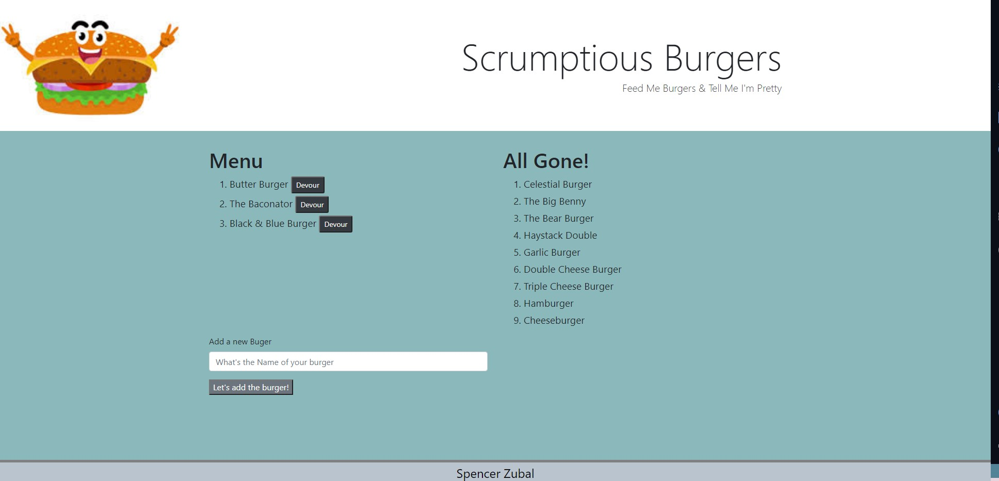

# Eat-Da-Burger

## Description
The goal was to develop a website that would allow the user to make burgers they have eaten and add new to the list. The app utilized mysql, express, orm, and handlebars.

## installation 
use npm i for the package.json file. Heroku is used to run the database and deploy the app.

## Resources
W3 Schools
Stack Overflow
Bootcamp activities 6, 7, 10, 16, and 17

## Screenshots
